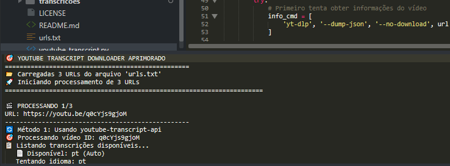

<!-- 
  Tags: DadosIA
  Label: ⬇️ Extraindo legenda do YouTube via cmd
  Description: Extraindo legenda do YouTube usando Python 
  path_hook: hookfigma.hook3
-->
# 🎯 YouTube Transcript Downloader Prompt Cmd

Um script Python para baixar transcrições de vídeos do YouTube de forma prática, com suporte a múltiplos idiomas e processamento em lote.



## 🌟 Recursos

- Baixa transcrições usando `youtube-transcript-api` e `yt-dlp`.
- Processa várias URLs de um arquivo de texto.
- Prioriza português (pt, pt-BR), mas suporta outros idiomas.
- Traduz transcrições automaticamente, se disponível.
- Converte legendas (VTT/SRT) em texto limpo.
- Exibe relatórios com status, tamanho e preview das transcrições.
- Inclui delays para evitar limitações de taxa.

## 📋 Pré-requisitos

- Python 3.7+
- Conexão com a internet
- Pacotes: `yt-dlp`, `youtube-transcript-api`, `requests`, `beautifulsoup4`

## 🔧 Instalação

1. Clone ou baixe o repositório:
   ```bash
   git clone https://github.com/Fabiuniz/youtube-transcript-downloader.git
   cd youtube-transcript-downloader
   ```

2. Instale as dependências:
   ```bash
   pip install yt-dlp youtube-transcript-api requests beautifulsoup4
   ```

## 📝 Como Usar

### Processamento em Lote

1. Crie um arquivo `urls.txt` com URLs do YouTube, uma por linha:
   ```
   https://www.youtube.com/watch?v=VIDEO_ID1
   https://youtu.be/VIDEO_ID2
   # Comentários são ignorados
   ```

2. Execute o script:
   ```bash
   python youtube_transcript.py
   ```

3. As transcrições serão salvas em `transcricoes/transcricao_VIDEO_ID.txt`.

### Uso Programático

```python
from youtube_transcript import YouTubeTranscriptDownloader

downloader = YouTubeTranscriptDownloader(output_dir="transcricoes", delay=5)
# Baixar um vídeo
transcript = downloader.download_single_video("https://www.youtube.com/watch?v=VIDEO_ID")
# Processar arquivo
resultados = downloader.process_urls_from_file("urls.txt")
```

## 📁 Estrutura de Saída

```
transcricoes/
├── transcricao_VIDEO_ID1.txt
├── transcricao_VIDEO_ID2.txt
```

## 🔄 Como Funciona

1. **YouTube Transcript API**: Busca transcrições em português ou inglês, com tradução automática.
2. **yt-dlp**: Baixa legendas VTT/SRT como alternativa e converte para texto.

## 📊 Relatórios

O script mostra:
- Status de cada download (✅ sucesso ou ❌ falha).
- Total processado, sucessos, falhas e taxa de sucesso.
- Preview e tamanho das transcrições.

### Exemplo:
```
🎯 YOUTUBE TRANSCRIPT DOWNLOADER
==================================================
📂 Carregadas 2 URLs do arquivo 'urls.txt'
🎬 PROCESSANDO 1/2
✅ Transcrição salva em: transcricoes/transcricao_dQw4w9WgXcQ.txt
📊 Tamanho: 1247 caracteres
✅ SUCESSO!
```

## ⚙️ Configuração

```python
YouTubeTranscriptDownloader(
    output_dir="transcricoes",  # Pasta de saída
    delay=5                     # Pausa entre downloads (segundos)
)
```

### URLs Suportadas
- `https://www.youtube.com/watch?v=VIDEO_ID`
- `https://youtu.be/VIDEO_ID`
- `https://www.youtube.com/embed/VIDEO_ID`

## 🛠️ Solução de Problemas

- **"No transcript found"**: Vídeo sem transcrição. Verifique se é público.
- **"yt-dlp not found"**: Reinstale com `pip install yt-dlp`.
- **"Permission denied"**: Cheque permissões da pasta `transcricoes/`.
- **Rate limiting**: Aumente o `delay` no construtor.

## 📄 Formato do `urls.txt`

```
# Comentários começam com #
https://www.youtube.com/watch?v=VIDEO_ID1
https://youtu.be/VIDEO_ID2
https://www.youtube.com/watch?v=VIDEO_ID3&t=30s
```

## 🤝 Como Contribuir

1. Faça um fork do repositório.
2. Crie uma branch: `git checkout -b minha-feature`.
3. Commit: `git commit -m "Minha feature"`.
4. Envie: `git push origin minha-feature`.
5. Abra um Pull Request.

## 📜 Licença

Licenciado sob a [MIT License](LICENSE).

## 🙏 Agradecimentos

- [yt-dlp](https://github.com/yt-dlp/yt-dlp)
- [youtube-transcript-api](https://github.com/jdepoix/youtube-transcript-api)

## ⚠️ Nota

Use apenas para fins educacionais e pessoais. Respeite os termos do YouTube e os direitos autorais.

## 👨‍💻 Autor

[Fabiano Rocha/Fabiuniz](https://github.com/Fabiuniz)

*Última atualização: Dezembro 2024*