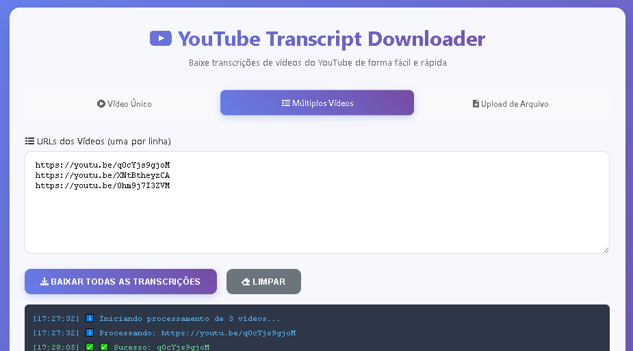

<!-- 
  Tags: DadosIA
  Label: ⬇️ Extraindo legenda do youTube
  Description: Extraindo legenda do youTube usando pynthon 
  path_hook: hookfigma.hook3
-->

# 🎯 YouTube Transcript Downloader

Uma ferramenta robusta baseada em Python para extrair e gerenciar transcrições de vídeos do YouTube, com interface de linha de comando e uma aplicação web moderna. Este projeto utiliza múltiplas estratégias para obter transcrições, garantindo alta compatibilidade e confiabilidade, com recursos avançados para automação e escalabilidade.



## ✨ Principais Recursos

### 🚀 Funcionalidades Principais
- **Extração Multiestratégia**: Combina `youtube-transcript-api` e `yt-dlp` para recuperação resiliente de transcrições, alternando automaticamente para métodos alternativos em caso de falha.
- **Interface Web**: Interface responsiva e moderna construída com HTML, JavaScript e Tailwind CSS, proporcionando uma experiência de usuário fluida.
- **Interface de Linha de Comando**: CLI poderosa em Python para automação, processamento em lote e integração em fluxos de trabalho maiores.
- **Processamento em Lote**: Suporta o processamento de múltiplas URLs do YouTube simultaneamente, com atrasos configuráveis para respeitar limites de taxa da API.
- **Suporte Multilíngue**: Prioriza português (pt, pt-BR) e inglês (en, en-US), com fallback para outros idiomas (ex.: es, fr, de).
- **Sistema de Fallback Inteligente**: Alterna automaticamente entre fontes de transcrição (manuais, automáticas, comunitárias ou traduzidas).
- **Saída Flexível**: Salva transcrições em arquivos `.txt` limpos ou arquivos `.zip` com metadados.
- **Logs Abrangentes**: Logs detalhados para monitoramento e depuração, com codificação segura para lidar com diferentes conjuntos de caracteres.
- **API RESTful**: Expõe endpoints para vídeo único, processamento em lote, upload de arquivos e download de transcrições.

### 🌐 Aplicação Web
- **Interface Moderna**: Construída com Tailwind CSS, com gradientes, animações e design responsivo.
- **Modos de Entrada**:
  - URL de vídeo único
  - Múltiplas URLs via entrada de texto
  - Upload de arquivo `.txt` com URLs
- **Feedback em Tempo Real**: Barras de progresso e logs ao vivo para uma interação amigável.
- **Estatísticas Detalhadas**: Resumo de downloads totais, bem-sucedidos e com falhas.
- **Opções de Download**: Suporta downloads de transcrições individuais ou arquivos `.zip` em lote com metadados.

## 🛠️ Tecnologias Utilizadas
- **Backend**: Python 3.7+, Flask, Flask-CORS
- **Bibliotecas**:
  - `yt-dlp`: Para extração robusta de mídia do YouTube
  - `youtube-transcript-api`: Para acesso direto a transcrições
  - `requests` & `beautifulsoup4`: Para requisições HTTP e parsing de HTML
  - `pathlib`: Para manipulação de arquivos multiplataforma
- **Frontend**: HTML, JavaScript, Tailwind CSS
- **Outros**: Subprocess para execução em CLI, `zipfile` para criação de arquivos compactados

## 📦 Instalação

### Pré-requisitos
- Python 3.7 ou superior
- `pip` (gerenciador de pacotes Python)
- `yt-dlp` (instalado via pip)

### 1. Clonar o Repositório
```bash
git clone https://github.com/Fabiuniz/youtube-transcript.git
cd youtube-transcript/monolito
```

### 2. Instalar Dependências
```bash
pip install -r requirements.txt
```

### 3. Instalar yt-dlp (se não estiver instalado)
```bash
pip install yt-dlp
```

### requirements.txt
```txt
flask>=2.2.0
flask-cors>=3.0.10
yt-dlp>=2023.12.30
youtube-transcript-api>=0.6.2
requests>=2.31.0
beautifulsoup4>=4.12.2
```

## 🚀 Como Usar

### 🖥️ Interface Web
1. **Iniciar o Servidor Flask**:
   ```bash
   python youtube_transcript_downloader.py
   ```
   Acesse a interface em `http://localhost:5000`.

2. **Escolher Modo de Entrada**:
   - **Vídeo Único**: Cole uma URL do YouTube.
   - **Múltiplos Vídeos**: Insira várias URLs (uma por linha).
   - **Upload de Arquivo**: Envie um arquivo `.txt` com URLs.

3. **Baixar Transcrições**: Clique em "Baixar Transcrições" e acompanhe o progresso na interface.

### 🐍 Linha de Comando
#### Uso Básico
```bash
python youtube_transcript_downloader.py
```

#### Processar um Arquivo
1. Criar um arquivo `urls.txt`:
   ```txt
   https://www.youtube.com/watch?v=VIDEO_ID1
   https://youtu.be/VIDEO_ID2
   # Comentários começam com #
   https://www.youtube.com/watch?v=VIDEO_ID3
   ```

2. Executar o script:
   ```bash
   python youtube_transcript_downloader.py
   ```

#### Configuração Personalizada
```python
from youtube_transcript_downloader import YouTubeTranscriptDownloader

# Inicializar com configurações personalizadas
downloader = YouTubeTranscriptDownloader(
    output_dir="transcricoes_personalizadas",  # Diretório de saída
    delay=3  # Atraso entre requisições (segundos)
)

# Baixar transcrição de um único vídeo
result = downloader.download_single_video("https://www.youtube.com/watch?v=VIDEO_ID")
print(result)

# Processar várias URLs de um arquivo
# Nota: O método de processamento de arquivo não está implementado no código fornecido; use o endpoint da API
```

### Endpoints da API REST
- **POST `/api/process-single`**: Processa uma única URL do YouTube.
- **POST `/api/process-multiple`**: Processa múltiplas URLs.
- **POST `/api/process-file`**: Processa URLs de um arquivo `.txt`.
- **GET `/api/download-transcript/<video_id>`**: Baixa uma única transcrição.
- **POST `/api/download-all`**: Baixa todas as transcrições como um arquivo `.zip`.
- **GET `/api/health`**: Verifica o status da API e suas dependências.

## 📁 Estrutura do Projeto
```
youtube-transcript-downloader/
│
├── youtube_transcript_downloader.py    # Script principal em Python
├── youtube_transcript_web.html         # Interface web
├── requirements.txt                    # Dependências Python
├── README.md                          # Este arquivo
├── urls.txt                           # Arquivo de URLs de exemplo
│
├── transcricoes/                      # Diretório de saída (criado automaticamente)
│   ├── transcricao_VIDEO_ID1.txt
│   ├── transcricao_VIDEO_ID2.txt
│   └── ...
│
└── docs/                             # Documentação adicional
    ├── examples.md                   # Exemplos de uso
    └── troubleshooting.md           # Guia de solução de problemas
```

## 🔧 Configuração Avançada

### Suporte a Proxy
```python
downloader = YouTubeTranscriptDownloader()
transcript = downloader.download_transcript_api(
    video_id="VIDEO_ID",
    proxy="http://proxy:8080"
)
```

### Personalização de Idiomas
Modifique a lista `idiomas_preferidos` em `youtube_transcript_downloader.py`:
```python
idiomas_preferidos = ['pt-BR', 'pt', 'en-US', 'en', 'es', 'fr', 'de']
```

### Ajuste de Timeout
Aumente o timeout para vídeos longos em `download_with_ytdlp`:
```python
result = subprocess.run(cmd, capture_output=True, text=True, timeout=120)  # 2 minutos
```

## 📊 Formatos Suportados

### URLs Aceitas
- `https://www.youtube.com/watch?v=VIDEO_ID`
- `https://youtu.be/VIDEO_ID`
- `https://www.youtube.com/embed/VIDEO_ID`
- `https://youtube.com/watch?v=VIDEO_ID`

### Tipos de Transcrição
- **Legendas Automáticas**: Geradas pelo YouTube
- **Legendas Manuais**: Enviadas pelo criador do vídeo
- **Legendas da Comunidade**: Contribuídas por espectadores
- **Traduções**: Transcrições traduzidas automaticamente

### Idiomas Suportados
- **Primários**: Português (pt, pt-BR), Inglês (en, en-US)
- **Secundários**: Espanhol (es), Francês (fr), Alemão (de) e outros

## 🎯 Exemplo de Uso da API
```bash
curl -X POST http://localhost:5000/api/process-single \
  -H "Content-Type: application/json" \
  -d '{"url": "https://www.youtube.com/watch?v=VIDEO_ID"}'
```

## 📄 Licença
Licenciado sob a [Licença MIT](LICENSE).

## 🙏 Agradecimentos
- **youtube-transcript-api**: Para extração confiável de transcrições
- **yt-dlp**: Para manipulação robusta de mídia do YouTube
- **Flask**: Para desenvolvimento de API leve
- **Tailwind CSS**: Para estilização moderna e responsiva

## 📈 Roadmap
- Adicionar suporte a streaming de transcrições em tempo real
- Implementar cache para consultas repetidas mais rápidas
- Melhorar a interface com modo escuro e recursos de acessibilidade
- Adicionar suporte a outras plataformas de vídeo

**⭐ Se este projeto foi útil, dê uma estrela no GitHub!**

*Última Atualização: Junho de 2025*

## 👨‍💻 Autor
[Fabiano Rocha/Fabiuniz](https://github.com/Fabiuniz)